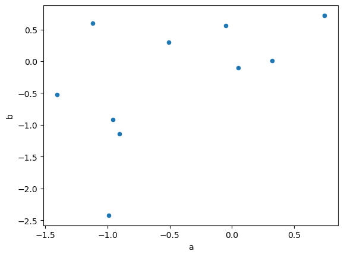

# Pandas 🐼 and Git 🫴🏼 task
This task is fully customizable, you can choose to do it however may you like, but you have to do it. You are encouraged to use the internet to search for answers, use information from the task Menna sent you, and use info from this task there. And of course ask your colleagues for help whenever you need it! 🤗
## Pandas 🐼

### 1. What is Pandas?

Pandas is a Python library used for working with data sets, you should know this by now. It has functions for analyzing, cleaning, exploring, and manipulating data. The name "Pandas" has a reference to both "Panel Data", and "Python Data Analysis" and was created by Wes McKinney in 2008.

Speaking of *analyzing, cleaning, exploring, and manipulating* data, what functions can you use for each of these tasks? 🤔:
- **A**nalyze data?
- **C**lean data?
- **E**xplore data?
- **M**anipulate data?

**Fill the table below:**
  

function | what it does | category
------------ | ----------- | ---------
`astype()` | Change the data type of an object |  **C**lean data
`groupby()` | Split the dataframe into groups  |  **M**anipulate data
`sort_values()` | Sort a data frame  |  **M**anipulate data
`pivot_table()` | Creates a MultiIndex dataframe   |  **A**nalyze data
`merge()` | Merge DataFrames or Series together |  **M**anipulate data
`plot()` | Make a desired plot of the DataFrame  |  **A**nalyze data
`corr()` | Compute the correlation(measure the strength and direction of a linear relationship) between columns  |  **A**nalyze data
`cov()` | Compute the covariance(measure only the direction of a linear relationship) between columns  |  **A**nalyze data  |  **A**nalyze data
`apply()` | Apply a function to a DataFrame or a series object  |  **A**nalyze data
`loc()` | Access rows by labels  |  **E**xplore data
`iloc()` | Access rows by index  |  **E**xplore data
`iterrows()` |  Iterate over DataFrame rows |  **E**xplore data
`aggregate()` | Apply a function or list of functions to a DataFrame  | **A**nalyze data

$\rightarrow$ You may insert code snippets here if you like!

### 2. Pandas and NumPy 🔢 [BONUS 🎁](https://www.imdb.com/title/tt1068680/)

Pandas is built on top of the NumPy package, which means that many of the methods in NumPy are also available in Pandas. Data in pandas is often used to feed statistical analysis in SciPy, plotting functions from Matplotlib, and machine learning algorithms in Scikit-learn.

Speaking of NumPy, here are questions about it:

- What is the output of the following code? And why is it so?

``` python
a = np.array([1, 2, 3])
b = np.array([4, 5, 6])
c = np.vstack((a, b))

print(c[1][2])
```
>6


- What is the output of the following code? And why is it so?

``` python
a = np.array([1, 2, 3])
b = np.array([4, 5, 6])
c = np.intersect1d(a, b)

print(c)
```

>[]

  
- What is the output of the following code? And why is it so?

``` python
a = np.array([1, 2, 3])
b = np.array([4, 5, 6])
c = np.setdiff1d(a, b)

print(c)
```

>[1, 2, 3]

- Which of the following is a function in NumPy used for carrying out Einstein summations?

    - [ ]  `np.tensordot()`
    - [ ]  `np.dot()`
    - [x]  `np.einsum()`
    - [ ]  `np.outer()`

- The `np.outer` function is primarily intended for:

    - [ ]  Computing the tensor dot product of two arrays.
    - [x]  Computing the outer product of two arrays.
    - [ ]  Computing the inner product of two arrays.
    - [ ]  Computing the cross product of two arrays.


### 3. Pandas and Matplotlib 📈
Pandas can be used to visualize data using a wrapper for `matplotlib.pyplot.plot()`. You can plot data directly from your DataFrame using certain functions.

- What functions can you use to plot data directly from your DataFrame? 🤔  
  - pd.df.plot.scatter()
  - pd.df.plot.line()
  - pd.df.plot.bar()
  - pd.df.plot.box()
  - pd.df.plot.kde()
  - pd.df.plot.hist()
  - pd.df.plot.pie()
  - pd.df.hist()
  - pd.df.boxplot()
  ----


- What is the output of the following code? And why is it so?  
``` python
df = pd.DataFrame(np.random.randn(10, 4), columns=['a', 'b', 'c', 'd'])
df.plot.scatter(x='a', y='b')
```


>`np.random.randn(10, 4)` returns two dimentions array(10 rows, 4 columns) of random numbers

>`df = pd.DataFrame(np.random.randn(10, 4), columns=['a', 'b', 'c', 'd'])`   make a DataFrame of the array and define its columns

>`df.plot.scatter(x='a', y='b')` make a scatter plot, putting column(a) on x-axis and column(b) on y-axis  
    Every point represnts values for two different numeric values in a and b columns

----

- What do you know about `np.random.randn()`? And how does it depend on `np.random.seed()`?
 
    >`np.random.randn()` returns n-dims array of random numbers
    `np.random.seed()`  make the random function generate the same values over and over again

## Git 🫴🏼
I know you are all familiar with Git, but let's see how much you know about it! 🤓

- What is the default text editor for the Bash shell with a Windows-based Git install?

    - [ ] Emacs
    - [x] Vim
    - [ ] Notepad++
    - [ ] Bash

- Before you install Git, which of the following prerequisite products must be present and configured on your local OS?

    - [ ] Python
    - [ ] Java Development Kit 1.8 or newer
    - [ ] Apache Maven
    - [x] Nothing


- After you install Git and prior to issuing the first commit, which two configuration properties does the tool expect to be configured?

    - [x] username and email address
    - [ ] username and password
    - [ ] email address and password
    - [ ] username and IP address

- Which of the following commands is used to create a new Git repository?

    - [x] git init
    - [ ] git clone
    - [ ] git commit
    - [ ] git push

- Which of the following commands is used to clone a remote Git repository?

    - [ ] git init
    - [x] git clone
    - [ ] git commit
    - [ ] git push

- Which of the following commands is used to stage a file for inclusion in the next commit?

    - [x] git add
    - [ ] git commit
    - [ ] git push
    - [ ] git pull

- Which of the following commands is used to commit staged changes to the local repository?

    - [ ] git add
    - [x] git commit
    - [ ] git push
    - [ ] git pull

- Which of the following commands is used to push committed changes to a remote repository?

    - [ ] git add
    - [ ] git commit
    - [x] git push
    - [ ] git pull

- Who is attributed with inventing Git?

    - [ ] Junio Hamano
    - [ ] James Gosling
    - [ ] Kohsuke Kawaguchi
    - [x] Linus Torvalds

- After you initialize a new Git repository and create a file named git-quiz.html, which of the following commands will not work if issued?

    - [ ] git add git-quiz.html
    - [ ] git status
    - [ ] git add .
    - [x] git commit -m "git quiz web file added"

- Which file can you configure to ensure that certain file types are never committed to the local Git repository?

    - [ ] ignore.git
    - [x] .gitignore
    - [ ] gitignore.txt
    - [ ] git.ignore

- Under which circumstance should you use a single dash within a bash command, as opposed to a double dash?

   - Single dash $\rightarrow$ When using single characters
   - Double dash $\rightarrow$ when using a word

- Which vendor acquired GitHub for $7.5 billion in June 2018?

    <mark>Microsoft</mark>

You may want to check [this](https://www.youtube.com/watch?v=Q6G-J54vgKc&t=16813s)

## Problem Solving 🤔
[A. Panoramix's Prediction](https://codeforces.com/problemset/problem/80/A)  
>[solution1](https://ideone.com/2yBKYr)

[A. Again Twenty Five!](https://codeforces.com/problemset/problem/630/A)  
>[solution2](https://ideone.com/2YpItN)
